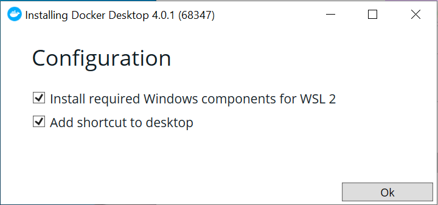
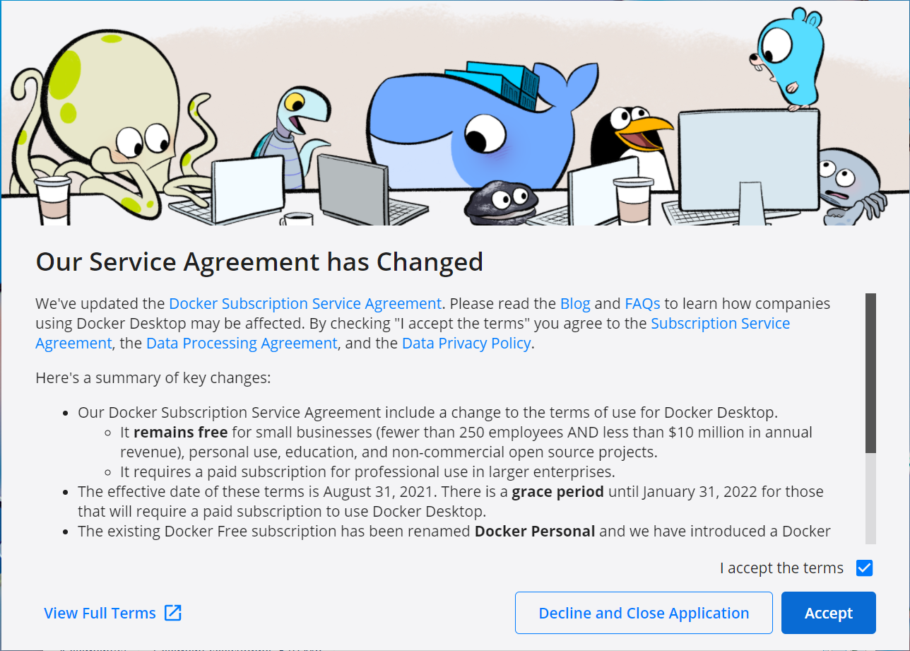
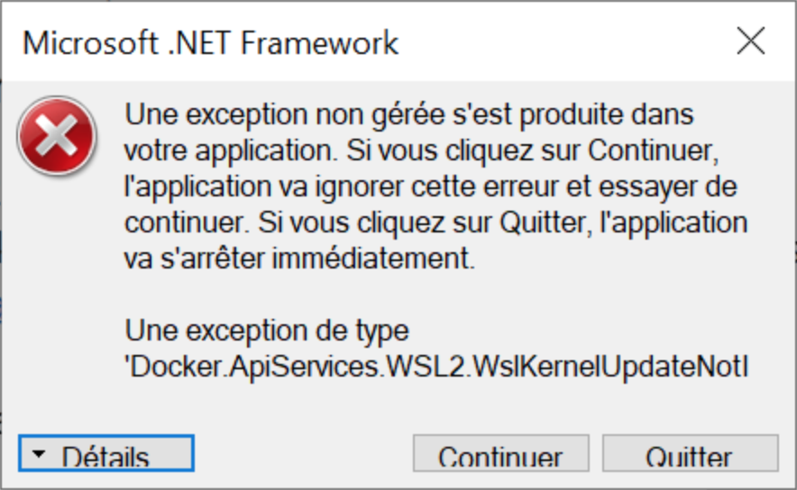
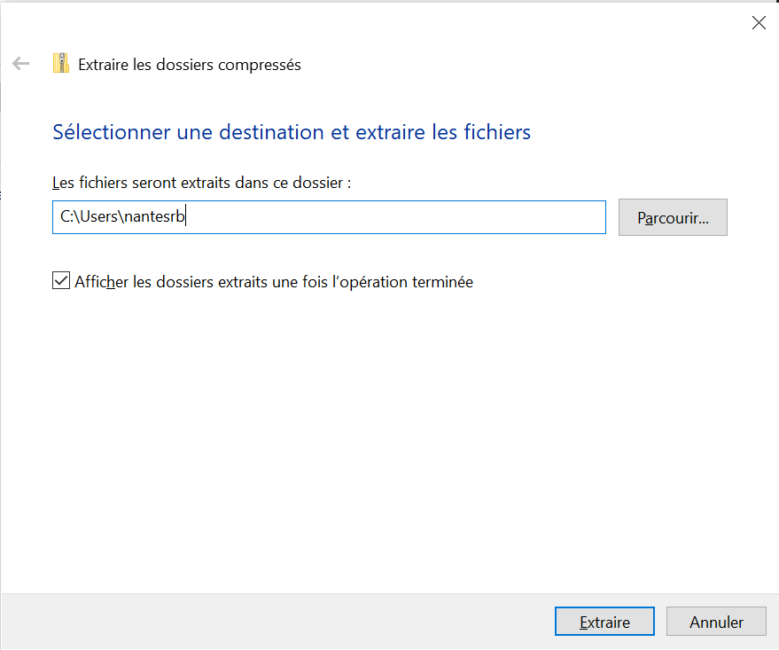
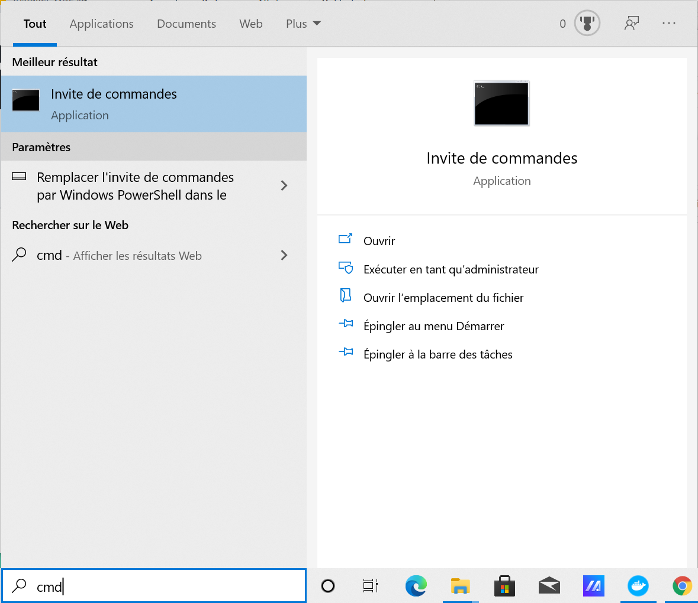
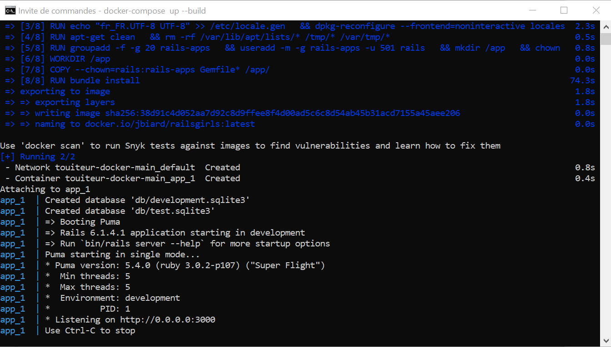
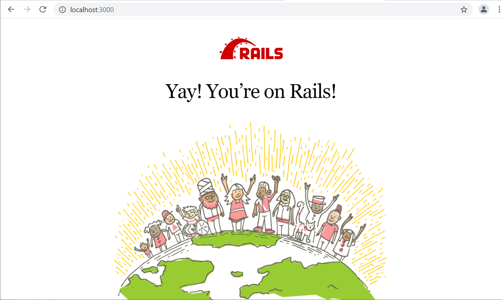

# Installation de l'environnement de développement sur macOS

Vous allez prochainement participer à une édition Rails Girls, et c'est une très chouette nouvelle. Pour bien préparer votre venue et gagner du temps le jour J, nous vous *recommandons* de suivre ces instructions, depuis chez vous, quelques jours avant l'évènement.

Si vous rencontrez le moindre problème ou avez la moindre question, n'hésitez pas à nous contacter par email : contact@rubynantes.org. Nous pourrons vous aider à distance et débloquer à peu près n'importe quelle situation.

Enfin, sachez que cette procédure d'installation n'est pas du tout représentative de ce que vous allez apprendre pendant Rails Girls, où l'on réalisera ensemble des choses bien plus intéressantes !

---

## 1. Installation de Docker

1. Rendez-vous à l'adresse suivante : https://www.docker.com/products/docker-desktop

2. Si vous possédez un mac avec processeur M1, cliquez sur le bouton **Download for Mac with Apple Chip**. Sinon, cliquez sur le bouton **Download for Mac with Intel Chip**

3. Une fois téléchargé, lancez le programme d'installation **Docker.dmg**.

4. Vérifiez que les options **Install required Windows components for WSL2** et **Add shortcut to desktop** sont sélectionnées, et cliquez sur **Ok**.



5. Acceptez les conditions d'utilisation.



6. Si vous rencontrez le message d'erreur suivant :



- Cliquez sur **Continuer**
  
- Cliquez sur le lien présent dans la boîte de dialogue (ne la fermez pas !) : https://docs.microsoft.com/fr-fr/windows/wsl/install-win10#step-4---download-the-linux-kernel-update-package


- Cliquez sur le lien **Package de mise à jour du noyau Linux WSL2 pour machines x64**. Cela déclenchera le téléchargement d'un petit utilitaire qui va débloquer la situation.

- Installer l'utilitaire **wsl_update_x64.msi**. Cette opération ne prend que quelques secondes.


- Une fois l'utilitaire installé, vous pouvez cliquer sur le bouton **Restart** de la boîte de dialogue d'erreur apparue juste avant.

7. L'installation de Docker est terminée. Félicitations !

---

## 2. Mise en place de l'application Touiteur

> *Touiteur* est l'application web que nous allons développer ensemble pendant la journée du samedi. Il s'agit d'une version *très* simplifiée de Twitter, que vous connaissez déjà.

1. Télécharger le code source de l'application à cette adresse : https://github.com/nantesrb/touiteur-docker/archive/refs/heads/main.zip

2. Décompressez l'archive ZIP dans le répertoire de votre choix : clic-droit + **Extraire tout**.


> :information_source: Dans la boîte de dialogue qui s'affiche, nous vous conseillons d'effacer la dernière partie `touiteur-docker-main` pour éviter que ce répertoire se retrouve en double.



1. Dans la barre de recherche Windows, tapez **cmd**. Puis lancez l'application **Invite de commande** qui apparaît en résultat.



2. Dans la fenêtre **Invite de commandes**, tapez `cd`, espace, puis glissez / déposez le dossier `touiteur-docker-main`  à partir de l'explorateur de fichiers dans cette fenêtre.

Vous devriez alors avoir quelque chose qui ressemble à ceci :


3. Appuyez sur la touche **Entrée**.

4. Entrez ensuite la commande suivante :

```
docker-compose up --build
```

Puis appuyez sur **Entrée**. Cette étape peut prendre plusieurs minutes, selon la vitesse de votre connexion Internet.

5. L'installation et la mise en place sont terminées une fois que vous voyez `Listening on http://0.0.0.0:3000` :



6. Depuis votre navigateur, rendez-vous à l'adresse http://localhost:3000. Vous devriez alors voir la page d'accueil suivante :



---

## 3. Installer un éditeur de code

Nous recommandons l'utilisation des éditeurs suivants :

- Sublime Text (léger et largement suffisant) : https://www.sublimetext.com/
- VSCode (plus complet) : https://code.visualstudio.com/

---

Et voilà, tout est prêt ! On se revoit donc très vite pour la suite.